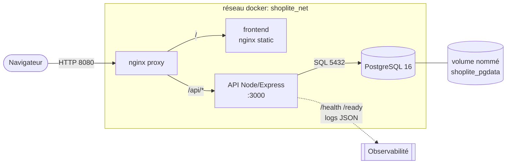
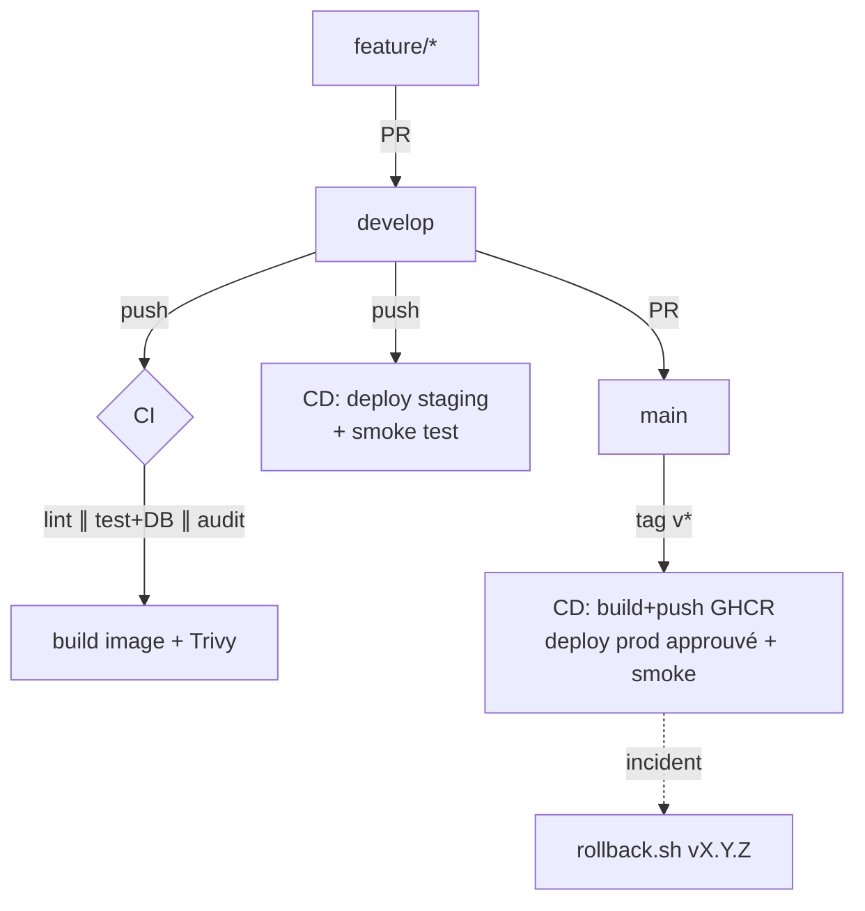
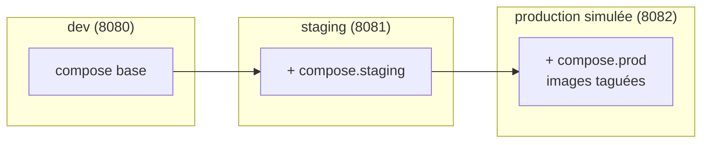

# Architecture — ShopLite

## Vue d'ensemble (runtime)

- **Point d'entrée unique** : le proxy nginx expose le port `8080` et route `/` vers le frontend et `/api/*` vers l'API.
- **Communication interne** : l'API joint la base via le **nom de service** `db` (DNS interne Docker), jamais via `localhost`.
- **Persistance** : la donnée vit dans le volume nommé `shoplite_pgdata`, indépendant du cycle de vie des conteneurs → survit aux `up`/`down` et aux rollbacks.
- **Démarrage ordonné** : `proxy` attend `api` (`service_healthy` sur `/ready`), qui attend `db` (`service_healthy` via `pg_isready`).

## Chaîne CI/CD

## Environnements

## Choix techniques

| Décision | Raison |
| -------- | ------ |
| Proxy nginx devant API + front | un seul port exposé, CORS simplifié, `X-Request-Id` injecté |
| Dockerfile multi-stage | image finale minimale (pas de devDeps ni cache de build) |
| Volume nommé pour PostgreSQL | persistance garantie, rollback sans perte |
| Images taguées en prod | déploiement déterministe, rollback vers un artefact connu |
| Logs JSON + request_id | corrélation des requêtes, prêts pour une centralisation |
